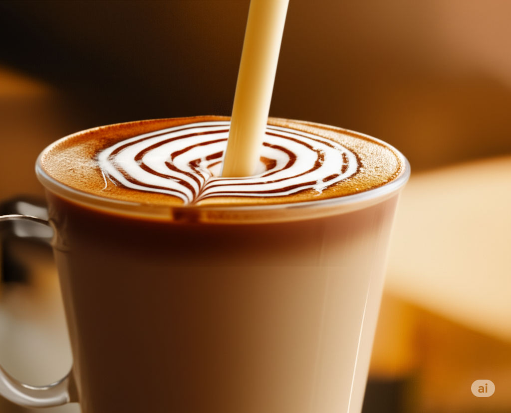

<div align="center">

# Seduh Santai

*One cup. Countless stories.*

Specialty coffee experience rooted in slow mornings, intentional craftsmanship, and warm editorial minimalism.

<br />



<br />

</div>

### The Essence

Seduh Santai is an artisanal coffee experience crafted for those who refuse to rush their mornings. Drawing inspiration from Japanese kissaten tranquility and warm editorial brutalism, the space balances generous negative space with tactile interactions—inviting visitors to slow down, explore seasonal roasts, and discover their local sanctuary.

### Highlights

- **Artisanal Warm Minimalism**: Restrained, tactile design with zero clutter, warm oat-milk canvas (`#FBF8F3`), and editorial typographic rhythm.
- **Inertial Smooth Motion**: Integrated with Lenis for unhurried scroll momentum and subtle parallax imagery.
- **Interactive Sanctuaries**: Multi-location café preview across Jakarta, Bandung, and Bekasi with live ambiance stories.
- **House Lineup Bento**: Dynamic coffee showcase highlighting signature roasts, notes, and brewing profiles.
- **Integrated Inquiries**: Lightweight contact service powered by Express and Nodemailer.

---

### Tech Stack

| Layer | Tools |
| :--- | :--- |
| **Core Framework** | [Vue 3](https://vuejs.org/) (Composition API, `<script setup lang="ts">`) |
| **Tooling & Engine** | [Vite](https://vitejs.dev/) + [TypeScript](https://www.typescriptlang.org/) |
| **Styling** | [Tailwind CSS v4](https://tailwindcss.com/) with native `@theme` tokens |
| **Typography** | Cormorant Garamond, Plus Jakarta Sans, Space Mono |
| **Motion** | [Lenis](https://lenis.darkroom.engineering/) smooth scroll |
| **Icons** | [Lucide Vue Next](https://lucide.dev/) |
| **Backend** | Express + Nodemailer |

### Getting Started

#### 1. Clone & Install
```sh
npm install
```

#### 2. Start Development Server
```sh
npm run dev
```

#### 3. Build for Production
```sh
npm run build
```

#### 4. Backend Service (Optional Contact Form)
```sh
node server.js
```

### Atmosphere & Palette

| Token | Hex | Role |
| :--- | :--- | :--- |
| **Canvas Base** | `#FBF8F3` | Warm oat-milk background throughout |
| **Navbar Surface** | `#483227` | Deep roasted coffee brown |
| **Toned Sand** | `#ECE2D4` | Card surfaces & editorial containers |
| **Text Primary** | `#14110F` | Espresso black |
| **Text Secondary**| `#756C65` | Muted warm clay |
| **Accent Primary**| `#C86D3B` | Caramelized amber |

---

<div align="center">
<sub>Crafted with patience and care · Jakarta · Bandung · Bekasi</sub>
</div>
